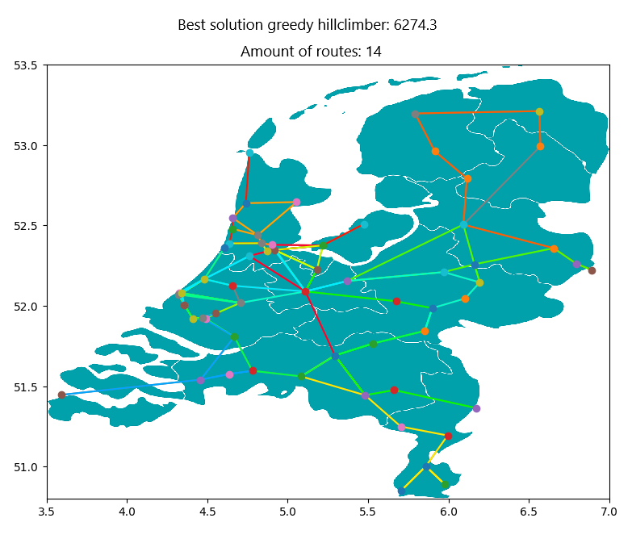

# RailNL Ticket-To-Ride
This module allows the user to optimize train routing for a rail network consisting of train stations and connections in batch mode with user-defined parameters.

Obtained results can then be visualized using the visualization tools supplied in visualization mode.

User-defined parameters are initialized from a .json file specified in the command line arguments.

By Simon de Jong, Finn Leurs and Hajo Groen

---

## Table of contents
* [Overview](#Overview)
* [Algorithms](#algorithms)
    * [Random](#random)
    * [Greedy Hillclimber](#greedy-hillclimber)
    * [Snake Hillclimber](#snake-hillclimber)
    * [Simulated Annealing Hillclimber](#simulated-annealing-hillclimber)
* [Tuning](#tuning)
    * [Convergence](#convergence)
    * [Logarithmic Cooling](#logarithmic-cooling)
    * [Linear Cooling](#linear-cooling)
    * [Geometric Cooling](#geometric-cooling)
* [Experiments](#experiments)
    * [Holland](#holland)
    * [Random Baseline](#random-baseline)
    * [Snake Hillclimber](#snake-hillclimber-1)
    * [Greedy Hillclimber](#greedy-hillclimber-1)
    * [Simulated Annealing Hillclimber](#simulated-annealing-hillclimber-1)
* [Usage](#usage)
* [References](#references)
---

## Overview

rain routing is a highly complex problem. It involves creating a rail network that routes existing connections between train stations in the most optimal a way. The routing of a rail network is considered optimal when the connection coverage is high and when the amount of duplicate connections is low. This while keeping the amount of routes in the rail network and the total time those routes in the rail network take as low as possible. Note that a high connection coverage does not mean every connection has to be used.

To measure the quality of a rail network in our case, it should generate as high as score as possible in the following function

$$
    K = 10000p - (100T + duration_{tot})
$$

Where p is the fractions of connections covered, T is the amount of routes in a rail network and durationtot is the sum of durations for all routes in the network. 

When optimizing a rail network for Holland, the network is restricted to 7 routes with a maximum duration of 120 minutes. The theoretical maximum score for this rail network would be 9219.0 if all connections were covered by as little routes as possible.

When optimizing a rail network for the Netherlands, the network is restricted to 20 routes with a maximum duration of 180 minutes. The theoretical maximum score for this rail network would be 7549.0 if all connections were covered by as little routes as possible.

## TODO
- Statespace

---

## Algorithms
## TODO
- Introduction of our algorithms
    - First developed a random algorithm, followed by 
        three separae algorithms
    - What are legal moves
    - Our score function

A legal move is appending a station to a route, so that it has a connection with a station in the
route and that the duration of the appended route does not exceed it's maximum duration.

 

### Random
The random algorithm would chooses amount of routes between a minimum (either 1 or the minimum amount of routes required to satisfy all connections) and the maximum amount of routes allowed for the problem. It would then choose a random maximum duration for every route between the duration of the longest connection in the system and the maximum duration for a route allowed by the system. It then attempts to fill the route up to the maximum duration until it can no longer make any legal moves.

Any new generated route has to be able to score points if they were in an isolated system. If a route does not adhere to this, it is emptied and a new route is made.

 

### Greedy Hillclimber
Greedy Hillclimber is an algorithm that improves a random rail network. It does so by taking the lowest scoring route in a rail network and then compares that to a randomly generated route. Whichever of the two routes is better gets incorporated into the rail network. It does this until it fails to improve the rail network 15 thousand times.

 

### Snake Hillclimber
This algorithm is a hill climber that seeks to optimize the score of a traject within the totally of the railNetwork.
Here for it takes a random generated railNetwork. Next it chooses for every traject if the first or last station needs to be removed. This happens randomly. Next it will add a station to the begin or the end of the traject. The goal is that every time a traject improves when in finds a better path to take. There is also the option the the traject adds another route. It calculates the totally of the scores before it approves if every single traject is indeed an improvement. Because it is possible that a new path taken optimizes the score of the singe traject, but downgrades the score of the totally of the railNetwork.

 

#### Adjustments to the algorithm
I noticed that this method has mainly effect on the outer stations of every single traject, but does not easily/often lead to changes in the middle of the traject. To resolves this problem, there are two algorithms with a small change. 'SnakeHillClimber1' removes the first two or the last two stations of the traject, and adds two.
'SnakeHillClimber2' removes the stations at the beginning or the end of a traject and replaces them next. This is done so that the middle section of traject will easily be changed as well.

 

### Simulated Annealing Hillclimber
The simulated annealing Hillclimber algorithm attempts to optimize a random solution for the train routing problem by either removing, adding or replacing a route. The algorithm is biased towards replacing a route with a 75% chance. Adding and removing a route both have a 12.5% chance to occur.

New routes are created in the same manner that they are created for the random algrithm.

Any change that results in a point increase for the system is immeadiately accepted. Otherwise it has a chance of being accepted based on it's cooling scheme.

 

#### Cooling schemes
The main use of using simulated annealing algorithms is that it allows an algorithm to accept a state that may scores less points than the previous state. This can prevent an algorithm from getting stuck at a local optimum, giving it more opportunities to find the true optimum state of a system.

Probability of the accepting the worse state is based on the score difference between the old and new state (dScore) and the "Temperature" (T) of the system according to the following formula1

$$
    P = e^{-{dScore \over T}}
$$

Probability increases with higher temperatures, and decreases with higher score differences. "Temperature" is therefore in layman's terms a measure for how likely a worse state is accepted.

In order to increase effectiveness of the hillclimber, the temperature is reduced according to a cooling scheme, of which four have been implemented:

 

#### Hillclimber
Not a cooling sceme per-se, but is handled as such. Makes the algorithm act purely as a hillclimber, a worse state for the system will never accepted.

 

#### Logarithmic cooling
The system temperature (T) depends on a single constant (C) and the total amount of iterations (i), as seen in the following formula1
$$
    T = {C \over log(1 + i)}
$$

The initial temperature (Tinit) in this case will be equal to
$$
    T_{init} = {C \over log(2)}
$$

#### Linear cooling
The temperature (T) of the system depends on an initial temperature (Tinit) and decreases linearly over iterations (i) with a constant speed (C) according to the following formula1

$$
    T = T_{init} - Ci
$$

A worse state is never accepted if the temperature is less than or equal to 0.

 

#### Geometric cooling
The temperature (T) of the system depends on an initial temperature (Tinit) and decreases geometrically over iterations (i) depending on a consant (C) according to the following formula1
$$
    T = T_{init}C^{i}
$$

Where C is any number between 0 and 1.

As T approaches 0, a worse state will not be accepted.

---

## Tuning
As the simulated annealing algorithm can make use of multiple cooling schemes and is heavily influenced by it's initial temperature and cooling constant. In order to more effectively apply the algorithm on the problem, the simulated annealing algorithm had to be tuned.

### Convergence
In order to find the best convergence limit, 8 batches of 10 runs were done with the simulated annealing algorithm in hillclimber mode with varying convergence limits, as seen below (note that the x-axis is not to scale).

From these runs, it was determined accepting runs with maximum convergence of `10 000`, `20 000` and `50 000` all yielded similar results. Therefore `10 000` was chosen, as it gives good scores in an acceptable timeframe.

### Logarithmic Cooling
As the logarithmic cooling scheme is relatively simple, with one parameter that both determines cooling speed and starting temperature, 7 batches of 10 runs were done with the simulated annealing algorithm with the logarithmic cooling scheme and different logarithmic cooling constants, as seen below (note that the x-axis is not to scale).

The cooling scheme with cooling constant 10 seemed to perform the best out of all the cooling constants, with both the highest average as well as the highest overall score. As this corresponds to an initial temperature of `32`, it was used as initial guess temperature for the `linear cooling` scheme.

### Linear Cooling
With an initial guess for the initial temperature, it was decided that the linear constant should be the initial temperature times a power of 10. To find the best power, 4 batches of 10 runs were done with varying linear constants, as seen below (Note that the x-axis has a logarithmic scale)

From this, `0.0032` (or `initial temp * 10^-4`) was chosen as best linear constant, as it had both the highest average score, as well as the best overall score.

Next, 3 batches of 10 runs were done with varying initial temperatures with proportionate linear constants were done as seen below (Note that the axis has a logarithmic scale).

From this, it was taken that initial temperature `64` had a more variable spread, yielding the best scoring solution that had thus yet been found, and was therefore taken as the best initial temperature for the `linear cooling` scheme.

### Geometric Cooling
The final cooling scheme to be tuned was the geometric cooling scheme. 64 was taken as initial temperature, as it performed well with the `linear cooling` scheme. It was decided that the geometric cooling constant should be of nines. Therefore 4 batches of 10 runs were done with varying geometric constants as seen below (Note that the x-axis has a logarithmic scale)

The geometric cooling scheme was taken to be outperformed by the `linear cooling` scheme, with initial temperature 64 and `linear cooling` constant `64 * 10^-4`, in all cases. For this reason, the `linear cooling` scheme was chosen as the best suitable for this problem.

---

## Experiments
### Holland
The first instance of the case asked to build a rail system with up to 7 routes of up to 120 minutes that utilize all rail connections in Holland and the second instance asked to optimize the system with the score function.

These instances were both evaluated over 10 runsusing the simulated annealing algorithm (`linear cooling`) with initial temperature `64` and `linear cooling` constant `64 * 10^-4`. 

All the resulting rail systems contained all rail connections, with a high scoring system with 9035 points, as displayed below.

As all 10 runs resulted in a high scoring system with all routes, it can be assumed that an optimal rail system in holland uses all rail connections. It was also observed that all optimized systems used either 5, 6 or 7 routes, but no less. The score is also very close to the theoretical maximum score of 9219, indicating that there is very little left that can be optimized for this network.

---

### Random Baseline
In order to judge a developed algorithm on it's effectiveness, a large baseline calculation from 1.6 million valid solutions was made using the random algorithm, which has been displayed in the histogram below.

From this, it was determined that the random algorithm had an average score of 2212.11, with most scores falling between 300 and 4000 points with a slight bias towards lower scores.

---

### Snake Hillclimber
To start with the comparison with the random baseline. The `snakeClimber` already improves this.
With results ranging from 4500 toward 5990 points. With a average of 5614. This is way above

`snakeClimber1` has an average of 5456, with a broader range. But interesting to see is that it turns out
that it gives more results on the higher end of the spectrum, even with results over the 6000 points.
Therefore it gives faster better results than the `snakeClimber`.

`snakeClimber2` has an average of 5515 with a the same minimun as 'snakeClimber', but it gives higher
results. It even reaches the 6500. This is probably due the fact that it has a higher probability
to change middle route. So the adjustments on the algoritm generated the expected changes.

It is interesting for further studies to see what will happen when we elimante 4, 5 or even 6 stations,
but this will probably redo a total route. Therefore the choice has been made to combine this algoritm `snakeClimber2`
with routeReplace algoritm. This is another algorithm that replaces the route with the lowest score.

The results of this algorithm `routeSnakeClimber` is as follows: it has an average of 5636 and the range is from 4700 to 6300.
This means that this algorithm has not gave a higher score than `snakeClimber2`, but it did gave a more usefull range.

The `snakeClimber2`- algorithm has run without the station Utrecht. This gave a surprising result: the scores were generally higher than that of the complete railNetwork. With an average of 5768 and an highest score of 6563.

---

### Greedy Hillclimber
With an average score of 5354.58 and a range of final scores between 4449.12 and 6274.28, the algorithm performs significantly better in a shorter amount of time.

---

### Simulated Annealing Hillclimber
In order to determine whether the `linear cooling` scheme of the simulated annealing algorithm would be effective, a baseline of the simulated annealing algorithm with the hillclimber cooling scheme was taken over 100 runs, which has been displayed in the histogram below.

From this, it can be concluded that the algorit without any cooling scheme already far outperforms the random algorithm, both in it's average score of 6165.99 and overall score spread.

The same baseline was made for the simulated annealing algorithm with the `linear cooling` scheme, with initial temperature 64 and `linear cooling` constant 64 * 10^-4, which has been displayed below.

The results from this baseline are interesting, as it shows a worse overall spread and lower average score of 6050.45, but also having a better median score and is more likely to obtain results with more than 6400 points overall. It is therefore preferrable to run with the `linear cooling` scheme when performing multiple runs over a longer period of time.

The overall score for the netherlands was also recorded using the algorithm with the same cooling schedule and parameters. This network had a score of 6605.0 and is displayed below.

Interesting about this solution is that it utilizes all possible connections in the Netherlands whilst still scoring higher than any other solution discovered.

### Station Removal

## TODO

#### Utrecht Centraal
- National junction
- Counter intuitively leads to higher overall scores as defined by our score function

#### Den Helder
- Often missing connection
- Does not result in major score differences with
    simulated annealing algorithm

#### Vlissingen
- Often missing connection
- Does not result in major score differences with
    simulated annealing algorithm

#### Groningen
- Reccommended to us
- Does not result in major score differences with
    simulated annealing algorithm

---

## Usage
### Batch mode
In order to optimize rail networks in batch mode, call the module like `python .\railNL [FILENAME].json`

.json properties for batch mode and their valid values are explained below.

 

### Main batch properties
`"jobType":` Whether an optimization algorithm has to be ran or if data has to be visualized. Valid values are `["batch" , "bat", "b"]` for batch mode and `["visualize", "vis", "v"]` for visualization mode.

`"stationsFilepath":` The filepath of the .CSV file containing station names and coordinates. Most commonly `"data/StationsNationaal.csv"` for the Netherlands and `"data/StationsHolland.csv"` for Holland

`"connectionsFilepath":` The filepath of the .CSV file containing rail connections and durations. Most commonly `"data/ConnectiesNationaal.csv"` for the Netherlands and `"data/ConnectiesHolland.csv"` for Holland

`"runs":` The amout of times the algorithm has to be ran in batch. Must be an integer equal to or more than 1.

`"algorithm":` The name of the chosen algorithm. Current options are:
- `"random"` - Random Algorithm
- `"annealing"` - Simulated Annealing Algorithm
- `"snakeclimber"`
- `"snakeclimber1"`
- `"snakeclimber2"`
- `"routesnakeclimber"`
- `"routeclimber_finn"`

`"runName":` The human readable part of the result filename.

`"targetFolder":` The folder to where results should be exported.

`"maxRoutes":` The maximum amount of routes allowed in the rail system. 7 for Holland, 20 for the Netherlands

`"maxDuration":` The maximum duration a route is allowed to have. 120 for Holland, 180 for the Netherlands

`"maxConvergence"`: The maximum amount of iteration the algorithm should continue to run for without score improvments.

 

### Algorithm specific properties
#### Simulated Annealing Algorithm
`"coolingScheme":` The name of the cooling scheme to be used. Current options are:
- `"Hillclimber"` - Runs the algorithm as a hillclimber
- `"Logarithmic"` - Runs the algorithm with the logarithmic cooling scheme
- `"Linear"` - Runs the algorithm with the linear cooling scheme. Best tested cooling scheme.
- `"Geometric"` - Runs the algorithm with the geometric cooling scheme.

`"initialTemperature":`: The initial temperature for the simulated Annealing algorithm. 64 for the best tested linear annealing scheme. Not nessesary when using the Logarithmic cooling scheme.
`"coolingConstant":` The constant in the cooling scheme. 0.0064 for the best tested linear annealing scheme.
    
---

### Visualization mode
In order to visualize obtained results, you also call the module like `python .\railNL [FILENAME].json`

The different types of visualization and their .json properties are explained below.

 

### Network visualization
Visualizes a solution for the train routing problem.

`"jobType":` any one of `["visualize", "vis", "v"]` 

`"plotType":` any one of `["network", "net", "n"]`

`"stationsFilepath":` The filepath of the CSV file containing station names and coordinates.

`"connectionsFilepath":` The filepath of the CSV file containing station connections anddurations.

`"resultFilepath":` The filepath of the solution csv file to visualize.

`"title":` The title of the figure.

`"stationNames":` True if station names have to be displayed next to station nodes, else false.

 

### Algotithm Convergence visualization
Plots the score of an algorithm over iterations.

`"jobType":` any one of `["visualize", "vis", "v"]` 

`"plotType":` any one of `["algorithm", "alg", "a"]`

`"resultFilepath":` The filepath of the run summary file to collect data from.

`"title":` The title to be displayed on the figure.

 

### Histogram visualization
plots the score data from a batch summary file as a histogram.

`"resultFilepath":` The filepath of the batch summary file to collect data from.

`"title":` The title to be displayed on the figure.

`"binCount":` The amount of bins for the histogram

---

## References
1: Mahdi, W.; Medjahed, S. A.; Ouali, M. Performance Analysis of Simulated Annealing Cooling Schedules in the Context of Dense Image Matching. Computación y Sistemas, 2017, 21. https://doi.org/10.13053/cys-21-3-2553